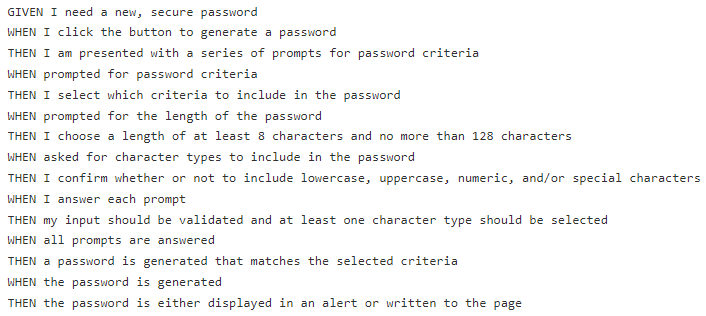

# JavaScript-Password-Generator

## **Deployed Link**

Click on the following link to view the live application: https://luccaloopz.github.io/JavaScript-Password-Generator/

## **Description**

This project generates a random password based off of certain user-selected criteria. There were 5 criteria inputs needed in order to generate the password, character length and whether or not the password contains lowercase, uppercase, numbers, and special characters. Users are prompted to type in the character length of their password and answer 'yes' or 'no' to each of the 4 character type questions. Once the prompts are done, the newly generated password appears on the user's screen. 

## **Acceptance Criteria**

See below:



## **Languages Used**

The programming languages used in this project were HTML, CSS, and JavaScript. 

## **Important Code Snippet(s)**

The JS file has multiple functions nested within each other. However, they are all written seperately from each other. The following function's purpose is to take the password that is generated in the `generatePassword()` function and inputs it to the `textarea` element of the html file (denoted by a `password` id). 

```JavaScript
function writePassword() {
  var password = generatePassword();
  var passwordText = document.querySelector("#password");

  passwordText.value = password;
}
```

The below function is the `generatePassword()` function. This function's main responsibility is to gather user input data and to create the password itself, which is then transferred to the function above. 

```JavaScript
function generatePassword() {
  alert("You will now begin choosing your password criteria.")
  issuePrompts();
  if (charactersToInclude) {
    var randomize;
    var password = [];
    for (i = 0; i < passwordLength; i++) {
      randomize = Math.floor(Math.random() * charactersToInclude.length);
      password += charactersToInclude[randomize];
    }
  }
  return password
}
```